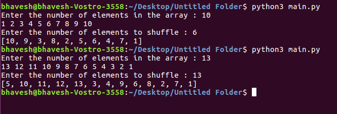

# Fisher Yates (Updated)

Given an array of length A, we want to randomly select N elements while making sure we don’t select the same element twice (random selection without replacement).
Fisher-Yates is an algorithm for shuffling an entire array of length A in O(A) time. Modify the Fisher-Yates shuffling algorithm to achieve our goal in O(N) time.

https://en.wikipedia.org/wiki/Fisher%E2%80%93Yates_shuffle

Hint: You should not shuffle the entire array unless N==A.

## Running the script

```
python3 main.py
```

## Screenshots



